In this section we explain the process of configuring BIMS to harvest GeoContext data from a GeoContext server for a collection of layers.

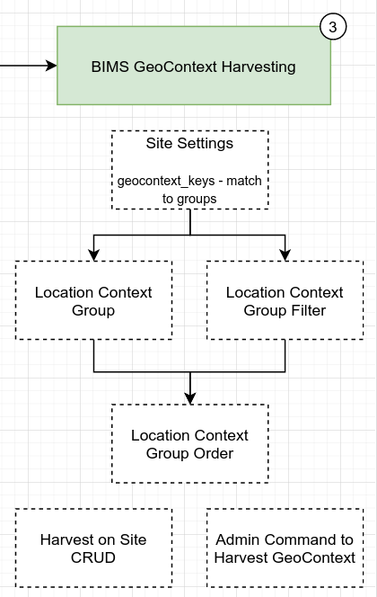

## Configuring geocontext settings for GeoContext

This section describes how to configure your geocontext settings to harvest GeoContext data for each site.

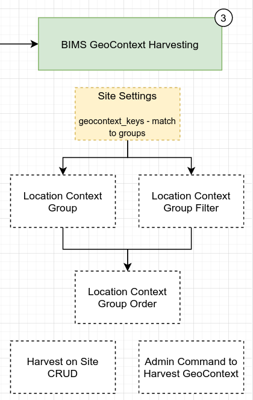

Open geocontext settings in admin page
Find Geocontext group keys field

* Add the GeoContext group keys in this field, use commas to separate multiple keys
* Click **Save** when you're done
* Now the system will check these keys to fetch GeoContext data for new sites

> Make sure that the key exists in the GeoContext, to check you can use this api : [https://staging.geocontext.kartoza.com/api/v1/geocontext/value/group/1/1/{geocontext_key}/](GeoContext API) change the geocontext_key in the url with the key you want to check

## Creating a Location Context Group in BIMS

In this section we explain how to create a location context group in the django admin interface for BIMS.

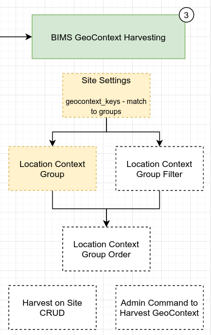)

To create a Location Context Group in BIMS, you need to know what layers are returned from the GeoContext group.

For instance, we want to create Location Context Group for Rwanda Catchments.

First, check the output from GeoContext with this API :
<https://staging.geocontext.kartoza.com/api/v2/query?registry=group&key=river_catchment_areas_group&x=24&y=-29&outformat=json>

Note : Change river_catchment_areas_group in the url with GeoContext group you want to add.

You will receive this data from GeoContext :

There are two service registry values (layers), so you need to add them both to the Location Context Group to display all those layers in the filter.

To add those layers please follow these steps :

Note : We will use this data for the following steps

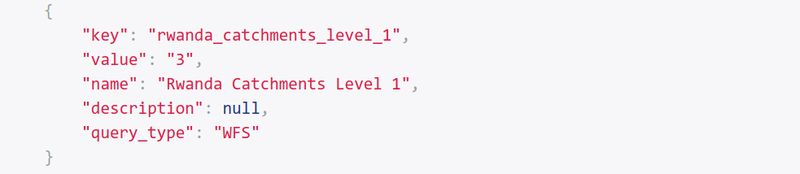

* Open Location Context Groups admin page
* Click Add location context group button at the top right corner
* Fill out these fields :
  * **Name** - Name of the layer, Rwanda Catchments Level 1
  * **Key** - Layer key, rwanda_catchments_level_1
  * **Geocontext group key** - Group key from GeoContext, rwanda_catchments
* Click **Save**

Then you need to do the same thing for other layer.

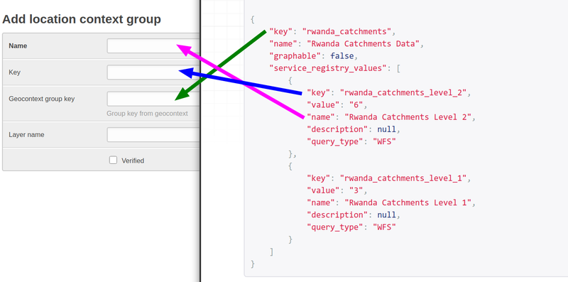

If you've done it correctly, then you will have two new layers in Location Context Group admin page :

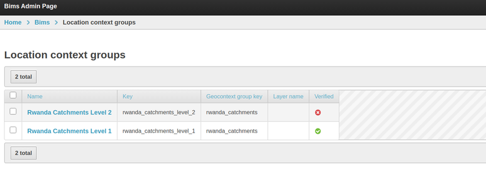

## Creating a Location Context Group Filter in BIMS

In this section we explain how to create a Location Context Filter in BIMS.

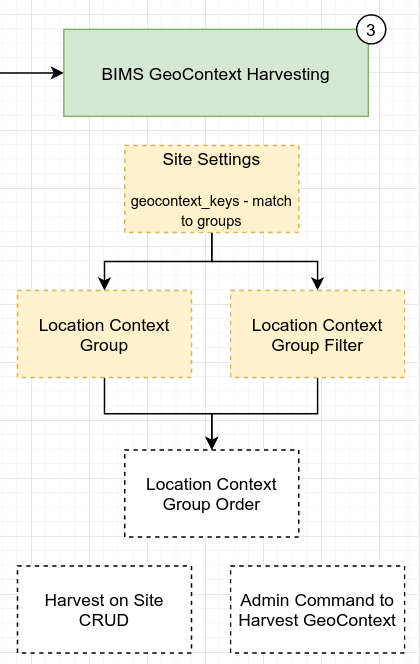

Location context filter is just the filter name for the spatial filter on the Map page.

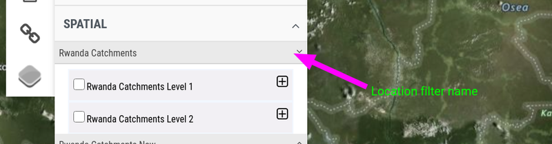

To add groups (Rwanda Catchments Level 1 & Rwanda Catchment Level 2) to the Location context filter please follow this guide.

To add new Location context filter please follow these steps :

* Open the Location context filter admin page
* Click Add location context filter button at the top right
* Fill up these required fields :
  * **Name** - Name of the location context filter
  * **Display order** - Order of this location context filter
* Click `Save` when you've done

## Configuring the order of Location Context Groups

In this section we describe the process of sorting Location Context Groups to control the order in which they appear in BIMS.

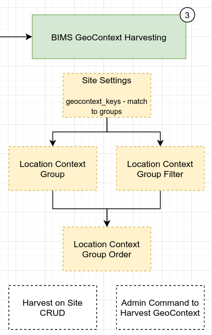

To do this guide, you need to add Location Context Group and Location Context Group Filter beforehand.

Open the admin page for Location Context Filter Group Order
Click Add location context group order button at the top right
Fill up these fields :

Group - Choose Location Context Group you want to show in the filter panel
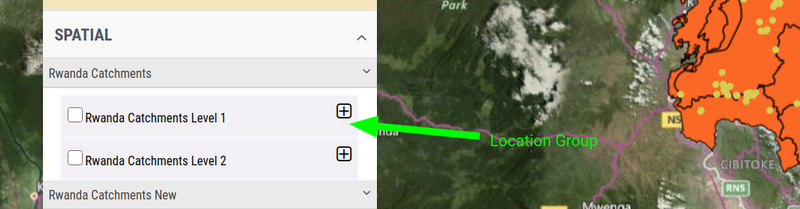

Filter - Choose Location Filter you want to show in the filter panel
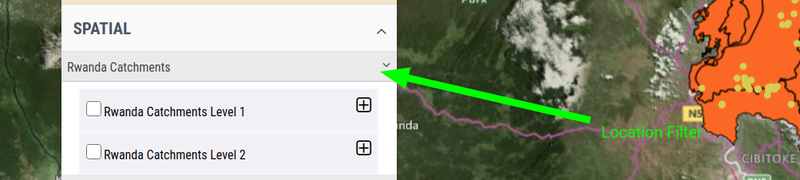

Group display order - This is the order of the groups inside the location filter
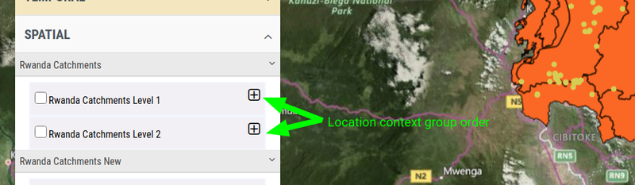

Show in dashboard (optional) - Whether to show this data in the dashboard or not
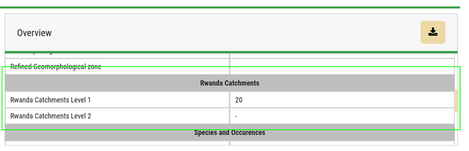

Show in side panel (optional) - Whether to show this data in the side panel or not
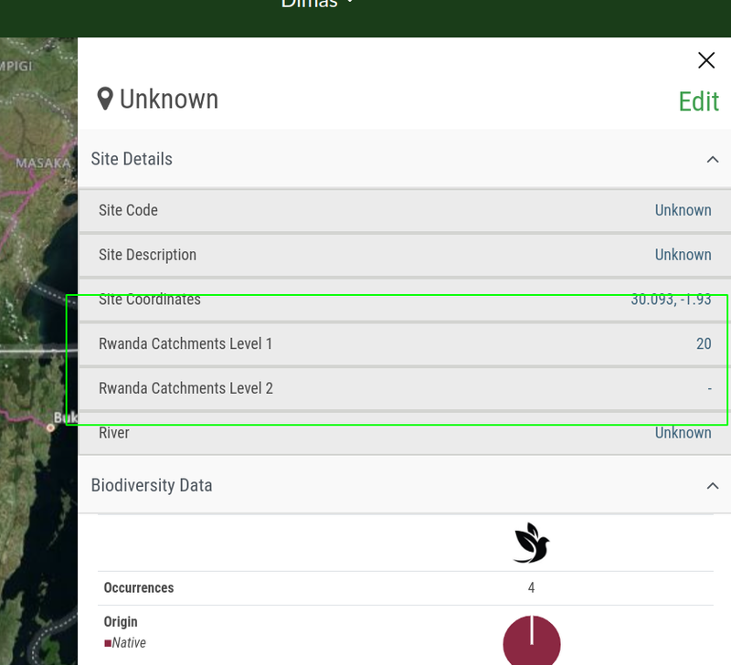

Click **Save** when you've done.

# Updating GeoContext data for sites using the admin panel

In this article we describe the process of updating the GeoContext data in one or more sites using the admin panel.

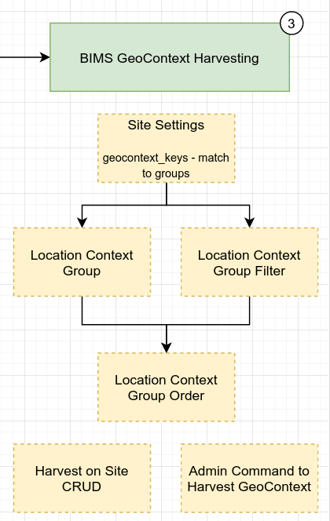

To update GeoContext data for existing sites please follow these steps : 
* Open Location Sites admin page 
* Select the sites you want to update the geocontext data

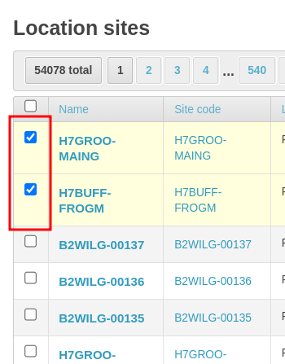

* Select 'Update location context data for selected sites in background.' in the dropdown located at the bottom of the page

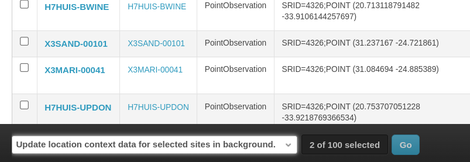

* Click **Go**. The system will try to update the geocontext data in the background
* To see the geocontext status open one of the previously selected location sites, scroll down to location context section to view all geocontext data and check if your geocontext data has been retrieved : 

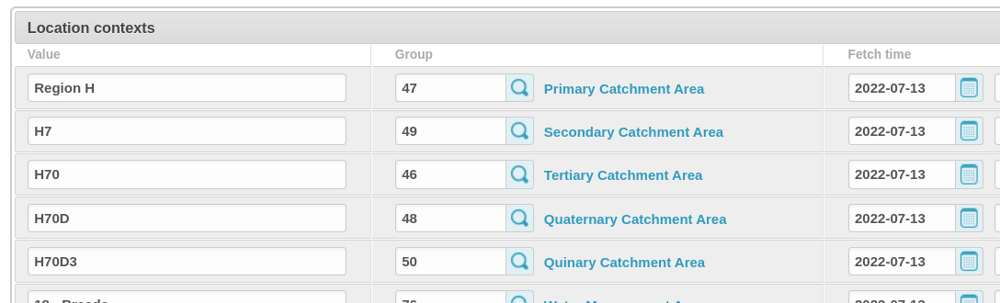
