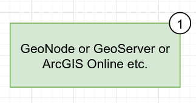
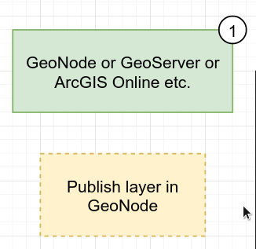
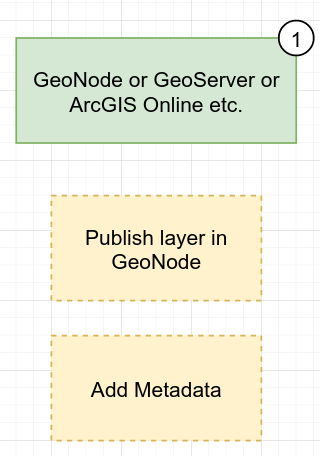
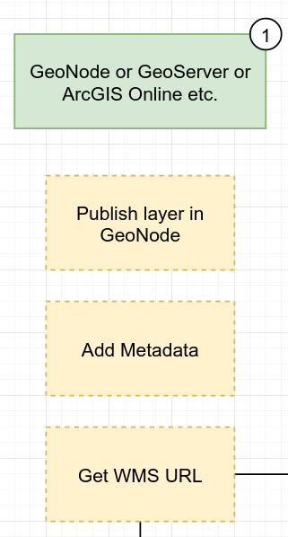
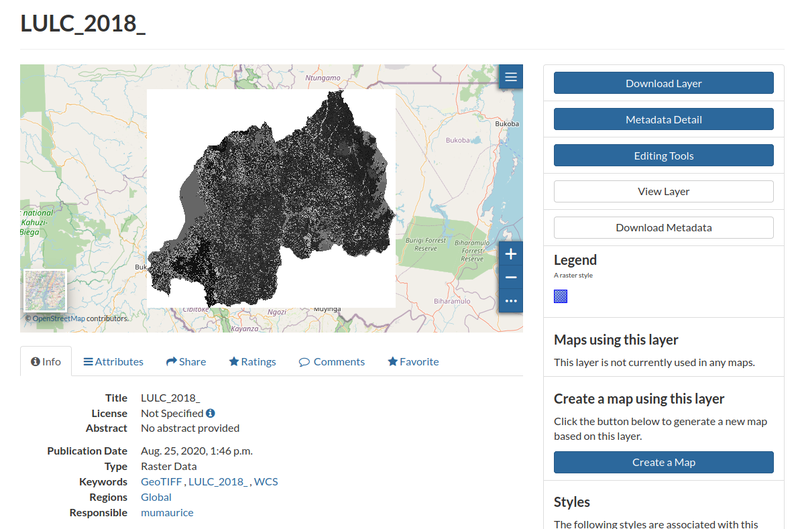
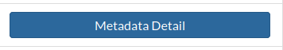
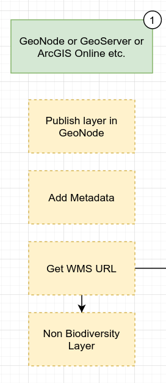
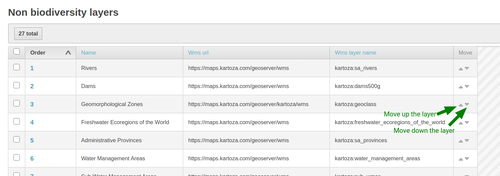
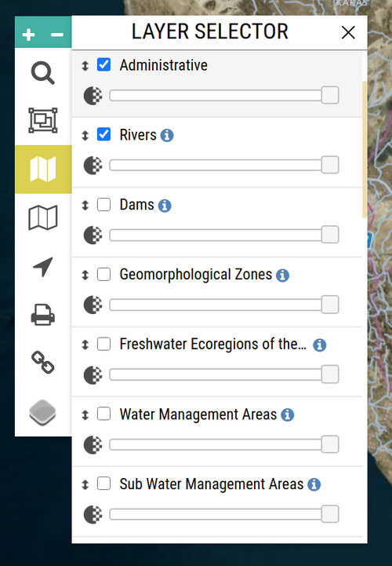

This subsection describes how to publish layers as WMS (Web Mapping Services) for use by GeoContext or as Visualisation layers. BIMS deploys with an instance of GeoNode that can be used for publishing these layers, but you can use any standards compliant web mapping server for this purpose.

First let us define the terms 'GeoContext Layer' and 'Visualisation Layer':

1. **GeoContext** layers are layers that you publish online as an OGC web service with the explicit intention that these layers are harvested by the <https://staging.geocontext.kartoza.com> GeoContext service.

1. **Visualisation** layers are used in the layer selector in BIMS and allow the user to add map overlays in the BIMS map view - for example to show soil types or catchment boundaries on the map.

In the next steps we will show you how to publish both of these types of layers.

## Publishing a layer in GeoNode

This article gives a short explanation of how to publish a layer in GeoNode. This is one way to provide a layer in GeoContext yourself.

To publish a layer from GeoNode you can follow this guide : <https://docs.geonode.org/en/master/usage/managing_layers/uploading_layers.html>

## Adding metadata to your published layer

The guide shows you how to add metadata to the layer you have published.

To add metadata to the layer in GeoNode please follow this guide : <https://docs.geonode.org/en/master/usage/managing_layers/layer_metadata.html>.

## Discovering the WMS URL for a published layer

In this guide we show you how to find out the WMS URL for a published layer so that the layer can be published in GeoContext or as a GeoContext layer.

Discovering the WMS URL for a map service requires that you have a platform where you can browse the services. This could be done though a GIS client such as QGIS or on a web interface such as GeoNode or GeoServer. For this example we will show you the workflow in GeoNode.

First browse to the map layer in GeoNode that you want to publish in BIMS:

Next click on the metadata detail button to view the metadata for the layer.

On the metadata page you will see a long list of information about the layer. First make a note of the "Title" of the layer e.g.:

> LULC_2018_

Now scroll down until you find the section called "References" and then look for the heading "OGC WMS: geonode Service". Right click on the service link and choose "Copy link location" from your browser's context menu.

Save the service URL that is now in your clipboard e.g.:

<https://geonode.rbis.kartoza.com/geoserver/ows>

## Adding a non-biodiversity layer to FBIS

In this guide we will show you how to publish a non-biodiversity layer in FBIS. Non-biodiversity layers can be displayed on top of the base map in FBIS to provide insights about the spatial situation of collection sites.

In order to add a layer to the FBIS, follow these steps :

* Go to admin page
* Click non biodiversity layer section
* Click Add non biodiversity layer button at the top right
* Fill out these required fields (see Discovering the WMS URL for a published layer):
  * Name - The name of the layer, will be displayed in the Layer Selector
  * WMS url - WMS url for this layer (if you're using GeoNode to host the layer you can try following link : {geonode_url}/geoserver/wms)
  * WMS layer name - Layer name from layer provider (e.g. geonode:layer_name)
  * WMS format - Format of the wms, default is in image/png
  * Get feature format - Output format of the GetFeature function, the default is in text/plain
* Click Save button at the bottom right
* To set the order in which the layers are displayed on the filter click these buttons :

These layers will appear in the Layer Selector on the map page.

