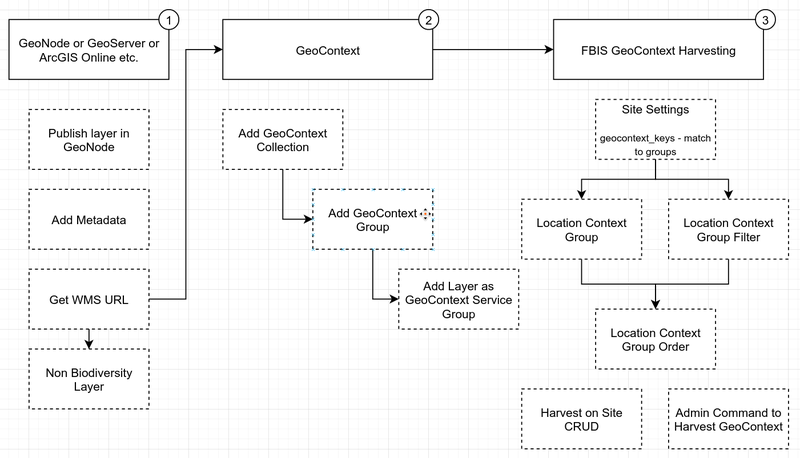
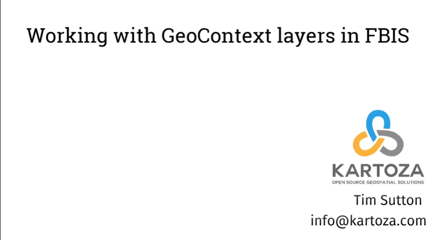

In this guide we will explain the high level concepts of the GeoContext substystem which is used to derive location related data for each occurrence record added to RBIS.

GeoContext is an independent service, available at <https://geocontext.kartoza.com/>. The purpose of GeoContext is to harvest data for point locations from a range of online databases. GeoContext allows you to register WMS/WFS/WCS layers in groups which in turn can be registered in a collection. You can then pass it a point locality and it will query every layer in the collection, returning a set of values, one for each layer under the point location.

As you can see from the above diagram, the workflow consist of three parts:

1) Publishing layers under e.g. WMS

2) Registering layers, groups and collections in the GeoContext service

3) Registering the GeoContext service(s) with BIMS

This tutorial will lead you through all of these steps. We expect that you are already familiar with platforms such as GeoNode, GeoServer and concepts such as OGC services. We also expect that you are familiar with and understand the basic operations and management of BIMS.

The following YouTube video walks through the steps described in this section of the documentation in detail with examples. If you are viewing this as a PDF or on the web, you can click on the image below to open the YouTube video.

