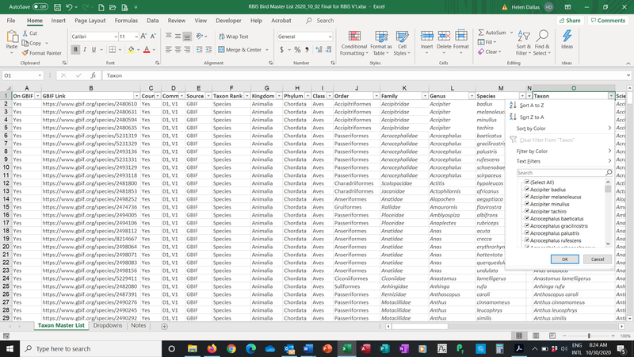
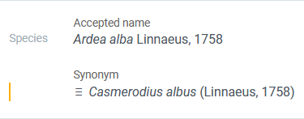
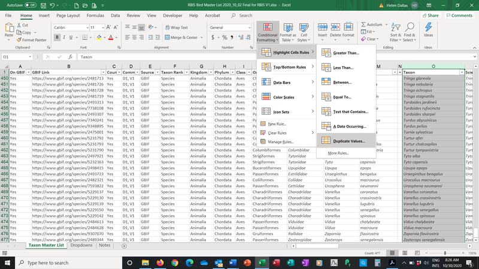
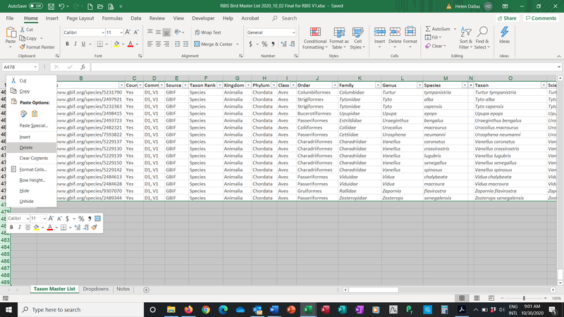
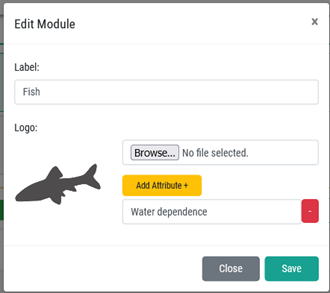

# Preparing and checking a Master List of Taxa before uploading

A taxonomic Master List is a list of all species and /or taxa within a particular group such as birds, fish, invertebrates, wetland plants, algae, etc. This section highlights issues and specific checks to improve accuracy of the Master List. The format of the Master List is important to ensure consistency for ingestion of data into the information system. The columns included in the Master Lists are detailed in the Data Management Guidelines.

> Only registered users with super user status are able to do this, typically the administrators .

## Creating a Master List

A taxonomic Master List is a list of all species and /or taxa within a particular group such as birds, fish, invertebrates, wetland plants, algae, etc. For some groups a species list is easy to produce as species level is commonly identified in studies (e.g. birds, fish). For other groups, the taxonomic level (family, genus, species etc) varies considerably from study to study, and thus it is recommended that the lowest taxonomic level is used and that Taxon is used in preference to Species (e.g. invertebrates, algae).

The purpose of the Master List is threefold:

1. To provide a comprehensive and up to date list of species/taxa for a specific group in a specific region. This needs to be done during the initial development of an information system such as FBIS or FBIS, but once the system is up and running, then the further updating of the Taxonomic backbone is done using GBIF and user-defined taxonomic uploads.
1. To facilitate downloading of data from the Global Biodiversity Information Facility’s (GBIF), thereby ensuring that the correct taxa are included on the information system.
1. To provide the taxonomic hierarchy for taxa not yet on GBIF.

The generation of a Master List requires consultation with available resources, relevant publications and experts. A Master List is intended to be an updatable resource, improved and added to as new data and studies are published, or new taxa are described. If no species lists are available for a country then the GBIF Taxonomic Master List may be generated by extracting data from GBIF. This Master List should then ideally be checked and validated for accuracy by the FBIS team.

The format of the Master List is important to ensure consistency for ingestion of data into the information system. The following columns are included in the Master Lists, provided as excel file template that will be used for each FBIS group (FBIS Master List of Taxa Template.xlsx). It is recommended that all columns be populated, with black compulsory and blue optional (explanations given in parenthesis):

* On GBIF (Yes or No if the taxon is on GBIF)
* GBIF URL (link to GBIF taxon)
* Country records (Yes, No, unknown – records in the country of interest)
* Comments (Details such as other countries if unknown or No above)
* Source (Details of the publication source for this taxon)
* Taxon Rank
* Kingdom
* Phylum
* Class
* SubClass
* Order
* Family
* SubFamily
* Genus
* Species
* SubSpecies
* Taxon
* Scientific name and authority
* Origin (Native, Non-native, Unknown)
* Endemism (Endemism categories):
  * Micro-endemic level 2 (Endemic to a single river or wetland)
  * Micro-endemic level 1 (Endemic to less than 5 rivers or wetlands)
  * Regional endemic level 2 (Endemic to a single primary catchment)
  * Regional endemic level 1 (Endemic to a single Freshwater Ecoregion (e.g. CFE), more than one primary catchment)
  * National endemic (Endemic to South Africa, occurs in more than one Freshwater Ecoregion within SA)
  * Subregional endemic (Endemic to southern Africa)
  * Widespread (Occurs beyond southern Africa)
  * Unknown (Endemism is unknown)
* Conservation status (Global) - The IUCN Red List of Threatened Species website (IUCN Red List, 2020)) classifies species into six main categories based on their extinction risk.
  * Extinct
  * Critically Endangered
  * Endangered
  * Vulnerable
  * Near Threatened
  * Least Concern
  * Data Deficient
  * Not Evaluated
* Common name
* Former scientific names

A separate Master List of Species / Taxa needs to be created for each group for which biodiversity data are served on FBIS. The Master List is ideally created before the consolidation of data so that the correct GBIF Taxonomic Backbone (<https://www.gbif.org/dataset/d7dddbf4-2cf0-4f39-9b2a-bb099caae36c>) is used for the data consolidation files. The taxonomy from GBIF should be used when the taxon is on GBIF. The FBIS team can check if the taxon is on GBIF using the following link: <https://www.gbif.org/species/1> and insert the relevant species, genus, family etc. in the “Select a species” box.

Taxa that are not on GBIF may be included in a Master List but the Source (Details of the publication source for this taxon) needs to be provided. Unfortunately several taxa may be missing from GBIF which, while it is the best available, is not always 100% correct.

There is also another platform that is useful, the Freshwater Animal Diversity Assessment (FADA) Project (<http://fada.biodiversity.be/>). FADA is the taxonomic backbone for its Freshwater Biodiversity Data Portal. One is able to consult and download FADA data, although it is not always up to date.

It is important that the correct Taxon Rank should always be used to ensure correct ingestion of the data files into FBIS.

Note: It is recommended that significant time and resources are used to generate and refine the master list for each group (birds, fish, invertebrates etc) as much as possible before proceeding with data collation. This is the list around-which all of the occurrence data will pivot: the more accurate it is at the start, the more time you save in the long run when collating the biodiversity data for those taxa.

# Checking a Master List for accuracy

To ensure the Master list is accurate, several steps should be taken before uploading taxonomic data. After consolidating the master list, you should check the following:

Apply filters for checking the data by highlighting the header row, clicking Data, Filter. All columns should be checked for consistencies and typos. Systematically work from column A to W. In particular, check consistency of the Taxon Rank and taxonomic hierarchy (Kingdom, Phylum, Class, Order, Family, Genus, Species, SubSpecies, Taxon).

It is important to check the GBIF taxonomy for accepted names and synonyms. For example, in the avian master list, Ardea alba - is the accepted name, whereas Casmerodius albus is the synonym. Preferably only accepted names should be included in the Master List of Taxa.

Taxa should be checked for duplicates by highlighting the Taxon column, and from the Home Menu, selecting Conditional Formatting, Highlight Cells Rules, Duplicate Values.

Note: All taxa can be updated after ingestion through the Taxon Management section.

Delete blank rows and columns. Lastly, ensure that there are no extra blank rows or columns, by deleting them.

Adding additional attributes for a specific taxon group.

It may be desirable to add attributes for specific taxon groups such as “Water dependence” (Highly dependent, Moderately dependent, Minimally dependent, Terrestrial). These additional attributes are assigned to each taxon during the uploading of the master lists as long as the additional attribute is added in Taxon Management before uploading.

This is done in the Edit Module form, Add attribute. The attribute needs to match the attribute column header in your Master List for uploading.

