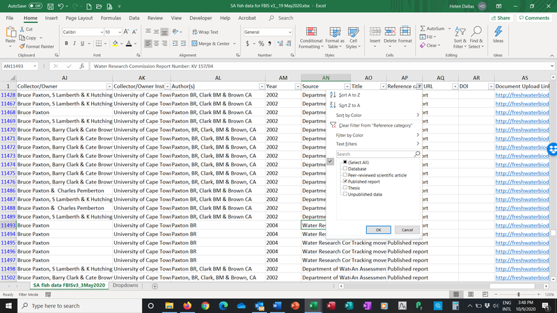

# Preparing and checking an Occurrence Data File before uploading

To ensure that data are accurate, several steps should be taken before uploading occurrence data. After consolidating the occurrence data in the data file, you should check the following.

Apply filters for checking the data by highlighting the **header row**, clicking **Data**, **Filter**


UUID. This is a unique code for each occurrence record. It needs to be copied and pasted so that the formula used to generate it is saved as a number.

See this video clip for guidance. <https://docs.rbis.kartoza.com/batch-importing-taxon-occurrence-data-bims/dealing-unique-identifiers/>

The UUID formula is available here:

```
=LOWER(CONCATENATE(DEC2HEX(RANDBETWEEN(0,POWER(16,8)),8),"-",

,DEC2HEX(RANDBETWEEN(0,POWER(16,4)),4),"-","4",DEC2HEX(RANDBETWEEN(0,POWER(16,3)),3),

"-",DEC2HEX(RANDBETWEEN(8,11)),DEC2HEX(RANDBETWEEN(0,POWER(16,3)),3),

"-",DEC2HEX(RANDBETWEEN(0,POWER(16,8)),8),DEC2HEX(RANDBETWEEN(0,POWER(16,4)),4)))
```

Systematically check each column using the dropdown arrows, and look for inconsistencies. Some common issues include, #num in UUID column instead of the UUID, incorrect spelling in the Site description column (e.g. Gakiriro wetland, Gakirirowetland), latitude with missing “-“ (e.g. 2.60059 as latitude is incorrect – should be -2.60059), longitude.

Also check that all sites fall withing the country boundary so that Site Codes may be generated correctly and geocontext data harvested for each site.


Check that all taxa are correct and are present in the Master List. If the drop-down of master taxa list was used then this should not be an issue. Check that the Taxon rank is correct.


Check presence is all “1”, check sampling method is correct.


Check Collector/Owner and Collector/Owner Institute. Ideally CAPITALS should not be used, First name Surname if known. Do not use middle initial and punctuation.

Preparing and checking an Occurrence Data File before uploading png 7

Check the metadata (Author(s), Year, Source, Title, Reference category, URL, DOI, Document Upload Link). For each study reference type, you need to populate the following columns:

* Peer-reviewed scientific article (Collector/Owner; Collector/Owner Institute; Author(s); Year; Source; Title; DOI or URL (if DOI is not available). For Peer-reviewed scientific article the Source is the Journal, For Peer-reviewed scientific article the Title is the title of the article.
* Published report (Collector/Owner; Collector/Owner Institute; Author(s); Year; Source; Title; URL or Document Upload Link). Note the Document Upload Link is obtained after the report is added.
* Thesis (Collector/Owner; Collector/Owner Institute; Author(s); Year; Source; Title; URL or Document Upload Link)
* Database (Collector/Owner; Collector/Owner Institute; Author(s); Year; Source)
* Unpublished data (Collector/Owner; Collector/Owner Institute; Author(s); Year; Source)

Check format of Author(s). It needs to be: Surname + Initials, no punctuation. (e.g. Tumushimire L, Mindje M, Sinsch U & Dehling JM not Lambert Tumushimire, Mapendo MINDJE, Prof. Ulrich Sinsch & Julian Maxmillian Dehling). It is important to get the authors correct (e.g. Sinsch Ulrich and Dehling, J. Maximilian, Lümkemann Katrin, Rosar Katharina, Christiane Schwarz should be Sinsch U, Lümkemann K, Rosar K, Schwarz C & Dehling M as per the doi).


Check the Date: This is the publication date (so 2012-2013 should be 2019 as this is when the article was published - Ecology and Evolution. 2019. Same with all other data from this study).


Check the Source. Please note when to include source or not, and what to include. (e.g. Mindje, M., Tumushimire, L., & Sinsch, U. (2020). Diversity assessment of anurans in the Mugesera wetland (eastern Rwanda): impact of habitat disturbance and partial recovery. Salamandra, 56, 27-38. Should be Salamandra)

* For Peer-reviewed scientific articles - the Source is the Journal.
* For Published Reports and Theses - the Source is the publisher of the Report.
* For Unpublished Data - the source is the title of the study.


Check the Title. For Peer-reviewed scientific article the Title is the title of the article, for Published reports or theses, it is the title of the thesis. Unpublished data don’t need a title.



Check all Reference Categories are correct: options include:

Database
Peer-reviewed scientific article
Published report
Thesis
Unpublished data

Preparing and checking an Occurrence Data File before uploading png 12

Check URL and DOI. Use a DOI if it is available, URL – only needed for Peer-reviewed scientific article if there is no DOI. For the DOI you only need to include the number part, so 10.1080/15627020.2012.11407524, not <https://doi.org/10.1080/15627020.2012.11407524>.


Check the document upload link is correct. Note the Document Upload Link is obtained after the report is added. Reports are only uploaded when there is no DOI or URL to link the data to. See section on Source References.

Checking for duplicate occurrence records. Use this formula for checking for duplicates. This is a combination of Site description, latitude, longitude, sampling date, Taxon, sampling method, author, year, source and title. Copy and paste the formula below into a new column at the end and name it “Duplicate check”.

```
=CONCATENATE(E2,G2,H2,I2,Q2,T2,W2,X2,Y2,Z2)
```

Then copy and paste the formula down to the end of the data rows. Then Highlight the column, and from the Home menu, select Conditional Formatting, Highlight Cells Rules, Duplicate Values.

Any duplicates will be highlighted. Check and delete duplicate occurrence records. Then delete the Duplicate Check column.


Delete blank rows and columns. Lastly, ensure that there are no extra blank rows or columns, by deleting them.


Remove the data filter, save the file in excel, and save the file as csv file.


