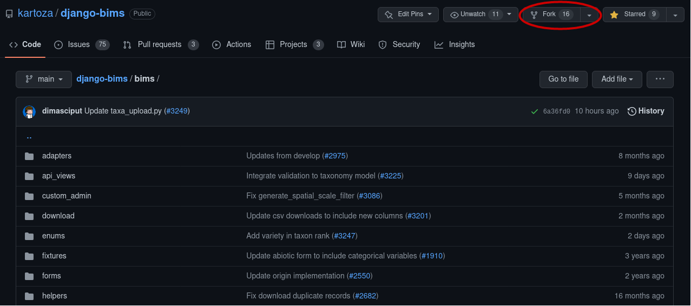
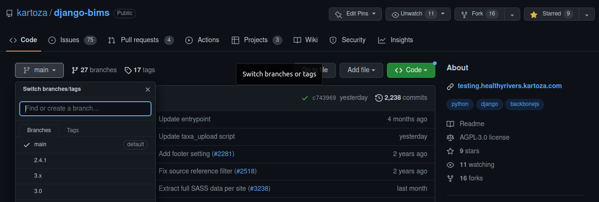
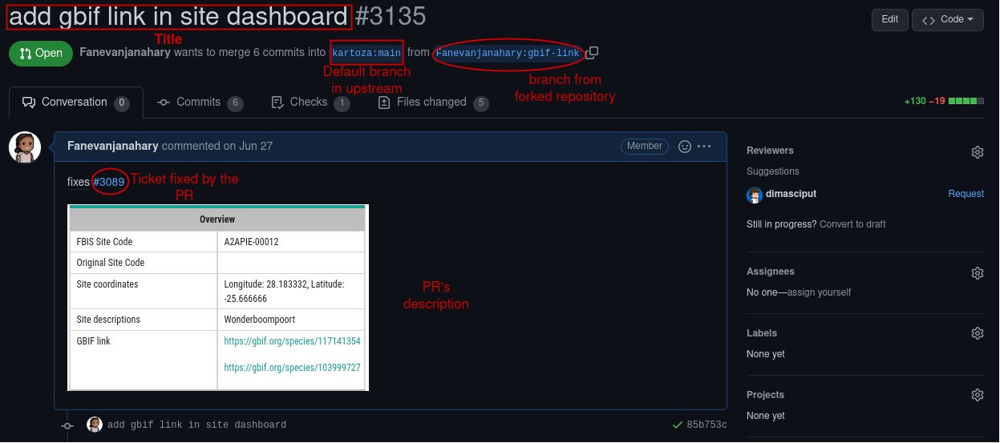
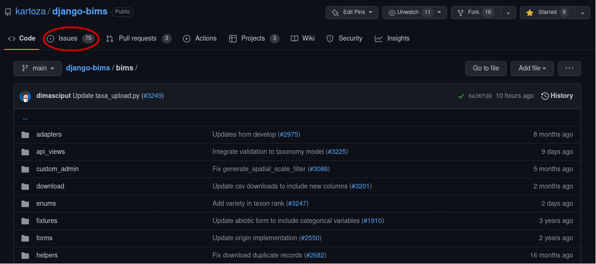
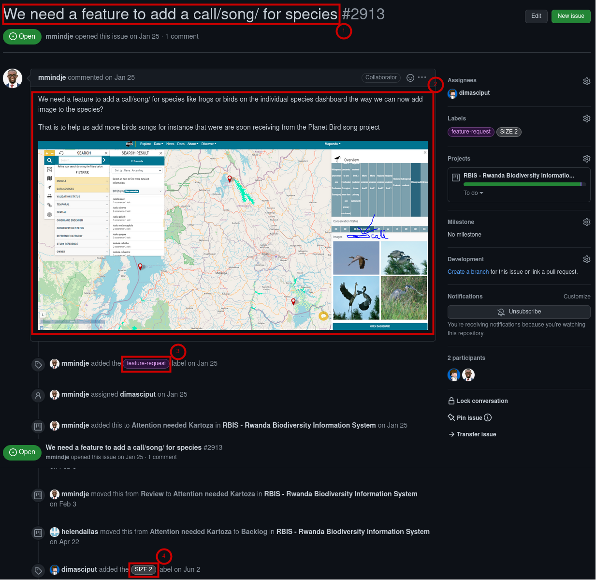
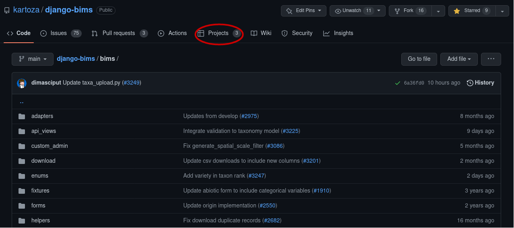
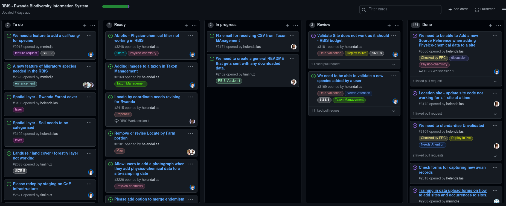

The source code of django-bims is hosted on [GitHub](https://github.com/). You need a personal account on GitHub to be
able to create repositories or collaborate on other projects.

### Getting Upstream Code

In an open-source project, users must properly integrate their contributions with other contributions. To ensure
that all contributors are pulling from the same place, you need to copy the upstream repository into a user's account,
and git provides an option called _**fork**_.



Generally, after cloning the project, you have a remote **origin**:

```
git remote -v
origin	git@github.com:kartoza/django-bims.git (fetch)
origin	git@github.com:kartoza/django-bims.git (fetch)

```

The **upstream** refers to the original repository, and the **origin** refers to the forked repository. With the remote
command, you can easily add, rename or remove a remote source:

```
git remote rename origin upstream
```

Verify that you have **upstream** now:

```
git remote -v
upstream	git@github.com:kartoza/django-bims.git (fetch)
upstream	git@github.com:kartoza/django-bims.git (push)

```

To add the remote **origin** execute the following command:

```
git remote add origin git@github.com:yourusername/django-bims.git
```

To check that the **origin** is added:

```
git remote -v
origin	git@github.com:Fanevanjanahary/django-bims.git (fetch)
origin	git@github.com:Fanevanjanahary/django-bims.git (push)
upstream	git@github.com:kartoza/django-bims.git (fetch)
upstream	git@github.com:kartoza/django-bims.git (push)

```

#### Sync the Latest Code from Upstream

To keep your local code and the original repository in sync, you can fetch the latest version of the **upstream** repository.
You can use these commands every time you want to get updates:

```
git pull upstream main
```

or

```
git fetch upstream
```

#### Working with Branches

A branch is used to isolate development work without affecting other work in the repository. A repository contains one
default branch and can have multiple other branches.



In **django-bims** the default branch is **main**.

A branch allows you to develop features and fix bugs. Generally, you create a new branch from an existing one, usually
from the default one.

To list all branches:

```
git branch
  csv_download
  filter
  gbif-link
  landing_page
  main
  sa_province
  sampling_method
  sass
  sorted_dropdown
* taxon_rank_variety
  unvalidated
  update_site_code
  upstream
  wt

```

To create a new branch:

```
git branch new_feature
```

To work on the new branch, switch to it and make your changes:

```
git checkout new_feature
```

Or if the branch does not exist, use this command to create it:

```
git checkout -b new_feature
```

You can merge a branch into another upstream branch using a Pull Request.

#### Pull Request (PR)

A Pull Request, or PR, is a way for a developer to tell other collaborators about the change they have made.



Once you have submitted a PR, other contributors can review your work. You can push commits from your local branch
to your existing PR.

[//]: # (maintaining separation between instance specific code and stuff that should be upstreamed)

#### Ticket <!--- working to tickets (raise ticket, size ticket, project board, scrum sprint planning etc)-->

A ticket identifies and tracks issues in the repository. In GitHub, an issue refers to a ticket. A ticket typically
should be created to:

* Record any bugs encountered in the application
* Propose any feature or enhancement
* Define whether it is a coding or non-coding task



Any PRs submitted to a repository must be linked to a ticket.

##### Open new ticket

When you open a ticket, it should be structured:



1. Title: it must be precise, clear, and as explicit as possible.
2. Description: it should be straightforward but sufficient to describe the exact scope of work and the desired outcome.
You can share a screenshot or a gif of the application as an additional explanation in the description. You can also
include other tickets or a PR as a reference.
3. Tag or label: this is optional but can be very beneficial. A ticket can have multiple labels like:
     * **bug**: something isn't working
     * **enhancement**: new feature or request
     * **Dashboards**: the key development is on the dashboard
     * **Data upload**: the key development is on data upload
     * etc.
4. Size: it is a label to set the time required to achieve a task or a ticket.
     * **SIZE 2** means you need to spend 2 hours to complete a task
     * **SIZE 5** means 5 hours are required.

##### Project board

A Project Board is a feature of GitHub that you can use to organize tickets and track the work that needs to be done on
the project. The Project Board is also used to manage workflow across a repository. You can create a Project Board for a
specific feature, work on a project, or even a sprint and release.



The Project Board is comprised of issues, pull requests, and notes that are categorized as cards in columns. You can
customize columns on the board based on your process. You can drag and drop cards to reorder them in a column or
move them to a different column. A column represents the status of an issue.



[//]: # (### Patch and Pull Request )
<!--- making your patch, submitting a PR -->

[//]: # (maintaining separation between instance specific code and stuff that should be upstreamed)

[//]: # (### GitHub action)

[//]: # (### Deploying to staging)

[//]: # ()
[//]: # (### Deploying to production)

[//]: # (### Backups <!--- restoring backups , getting backups and basic sysadmin workflows-->)
