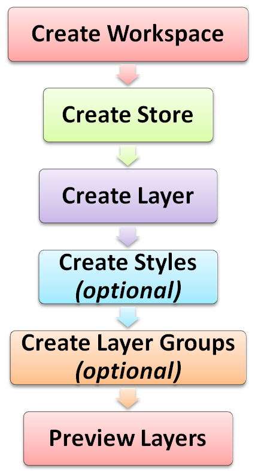

[GeoServer](https://geoserver.org/) is a Java based open source software server which has the ability to share and edit geospatial data in open standard format. GeoServer allows a user to add, remove, edit and control geospatial content through a web browser, which can generate different OGC standard services such as WMS, WCS, WFS, and SLD etc. The main objective and purpose of GeoServer is to offer potential to create maps and share data in compliance with OGC standards.

## Why use GeoServer?

* Implements **OGC compliant standards**.
* **Open Source** – freely available to download and use.
* **Integrates** with existing applications and APIs such as Google Earth and ESRI ArcGIS.
* **Community support** relating to developing, troubleshooting and software tutorials.
* Frequent **upgrades** and development, improving the functionality, quality and ease of use.

## Main features and capabilities

* Implements the **OGC standards** in compliance with the OGC standard specifications.
* Easy to use **web configuration tool**.
* Support for **PostGIS**, Shapefile, ArcSDE, DB2 and Oracle.
* Supports a wide range of **raster and vector** formats (GeoTiff, ESRI Shapefiles, PNG, JPG, KML, GML).
* Google Earth support.
* Integrates with **OpenLayers**, GeoWebCache and GeoTools.
* User Interface supports **multiple languages** (English, French, German, Russian etc.)
* **Flexibility** in controlling and setting up GeoServer, tailoring it to the users requirements.

The diagram below shows the workflow relating to ingesting data into GeoServer and previewing the data.

Content above available from [learning geoserver](http://learningzone.rspsoc.org.uk/index.php/Learning-Materials/Introduction-to-OGC-Standards/7.3-GeoServer).
