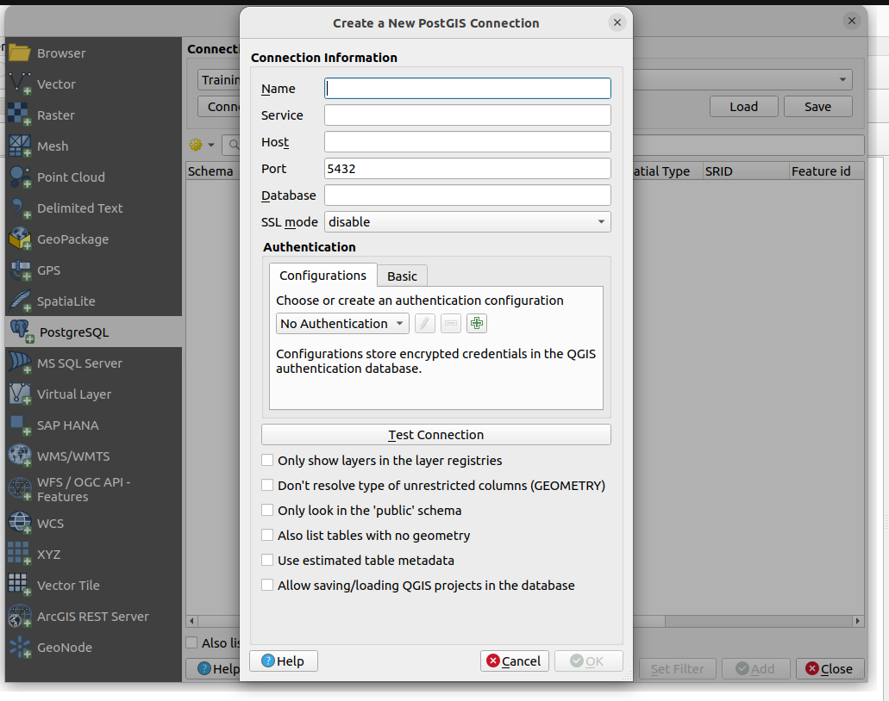
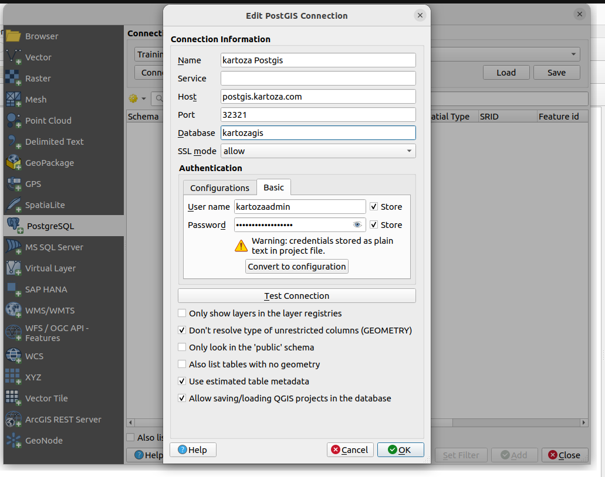
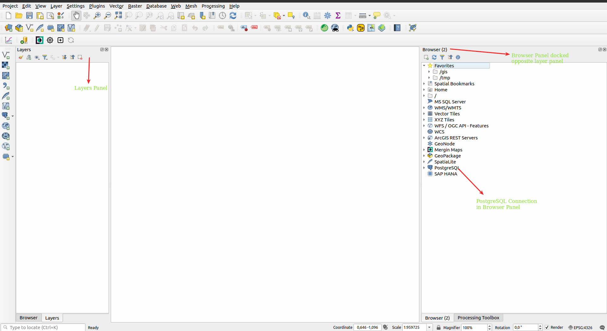
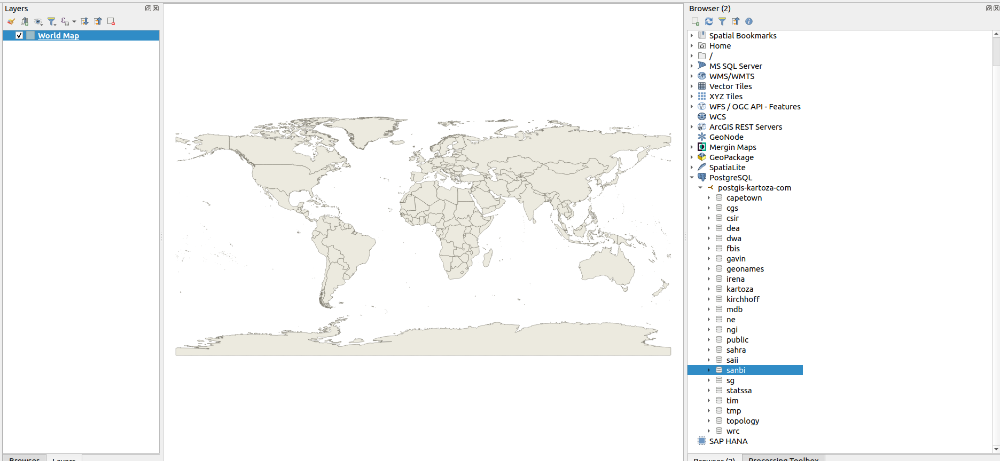
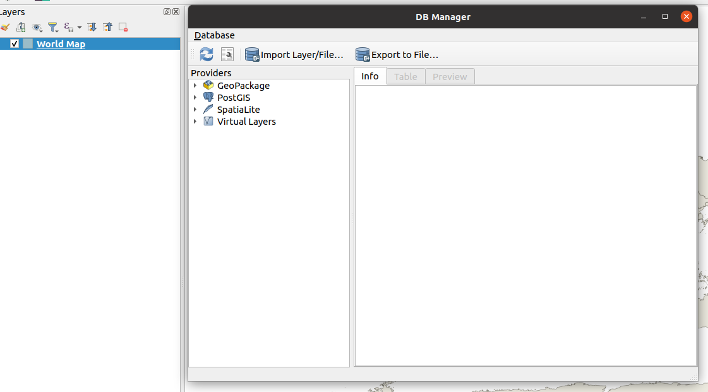
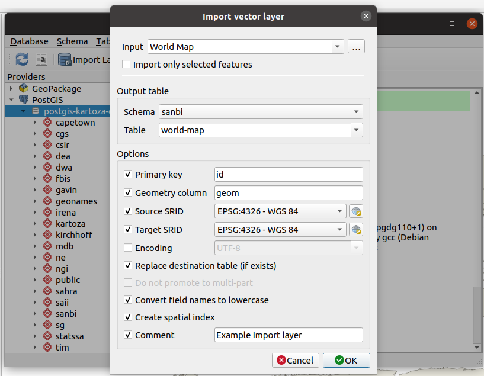

Spatial data consist of vector and raster data. In this guide we will explain the
process of loading vector data into a PostgreSQL database.

> We assume users have a running instance of QGIS on their machines. If you
do not have a running version you can download and install an appropriate [QGIS version](https://www.qgis.org/en/site/forusers/download.html) based on your architecture. Also acquire the credentials for the database from your database administrator.

There are various ways to load vector data into the database but, we will concentrate
on the easier methods. This usually involves the following:

* Define a database connection - this is a once off task.
* Loading the data through various methods i.e Drag and Drop or Database Manager.

## Setup PostgreSQL Connection Parameters

**Step 1.** Open QGIS Desktop.

**Step 2.** On your icons toolbar click the PostgreSQL icon to add layer or alternatively click on the **Layers Menu** > **Data Source Manager** > **PostgreSQL** 

**Step 3.** Click to create a new database connection. 

**Step 4.** Populate the dialog with your user credentials. 

**Step 5.** Save your connection parameters.

## Loading Spatial Data

### Using the QGIS Browser

All panels in QGIS can be docked and arranged based per user's needs. It is
encouraged to dock your layers and browser panel on opposite sides in QGIS.

**Step 1.** Load your vector layers into QGIS.
**Step 2.** Open the browser tab that you have docked on the opposite end of the layer panel.
**Step 3.** In the browser panel navigate to open the PostgreSQL connection you defined
earlier on.

**Step 4.** Select the appropriate schema from your PostgreSQL connection.
**Step 5.** Drag the layer from the layers panel dropping it onto the selected schema
in the browser panel.
**Step 6.** Wait for the layer to complete loading.

After loading the layer it will be available in the selected schema and ready to use in GeoServer.

### Using DBManager

When using this method it is assumed a user has already defined a database connection.

**Step 1.** Navigate to the Database Menu in QGIS and from the drop down choose
**DBManager**. `Database Menu > DB Manager`

**Step 2.** Select your PostgreSQL connection.
**Step 3.** Click on the **Import Layer/File** on top of the DB Manager dialog.
**Step 4.** Populate the import layer dialog choosing the appropriate options.

**Step 5.** Accept the values and wait for the layer to be loaded.

> The QGIS processing tool also provides other options to load spatial
data into a PostgreSQL database. Those tools also provide the users with the option
to do bulk inserts of multi layers simultaneously.
