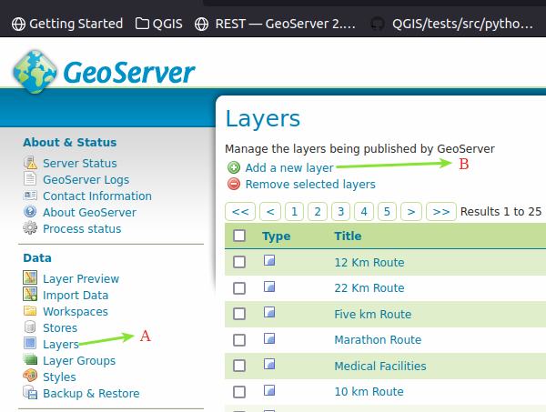
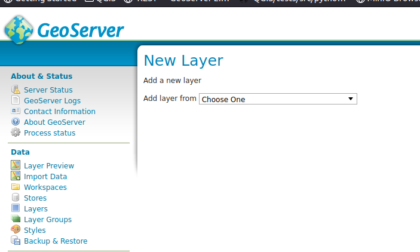
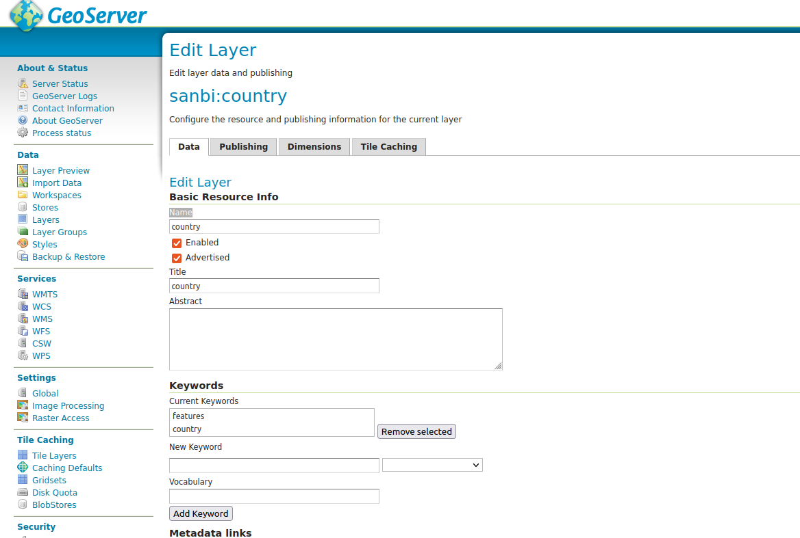
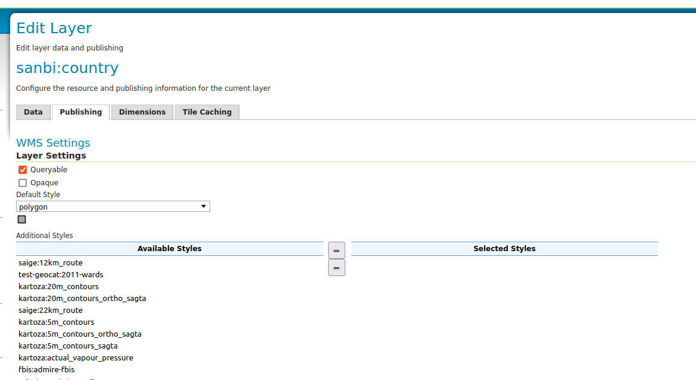
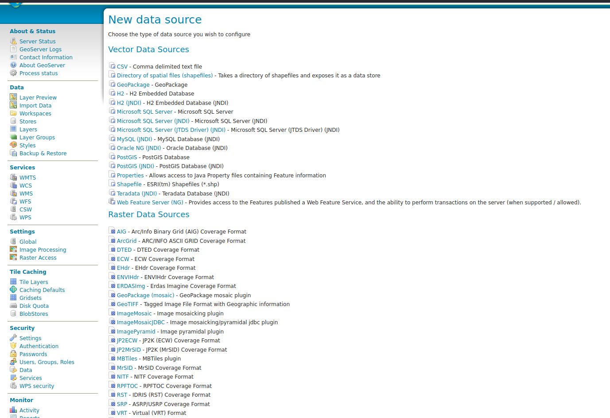
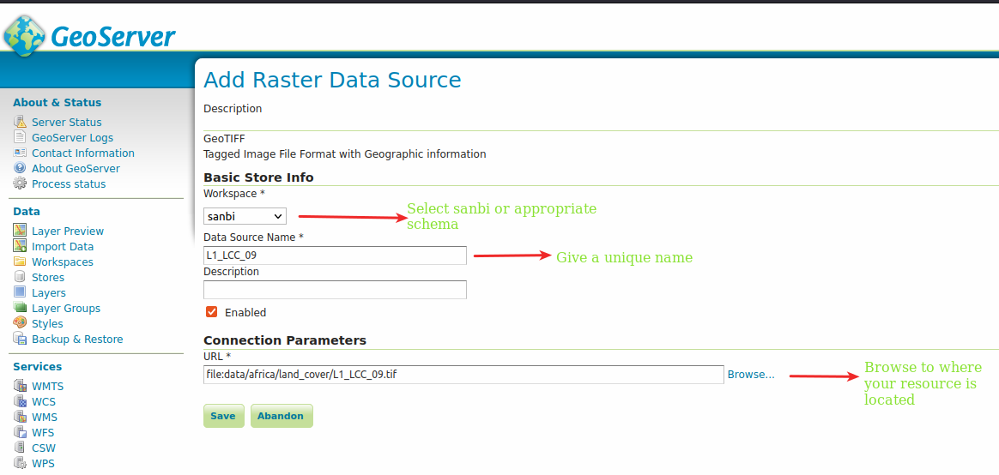

GeoServer can publish vector data from various sources i.e shapefile, geopackage. In our
use case we already have spatial data stored in a relational database and, we will be publishing this data to GeoServer. A relational database has a lot of advantages over the traditional formats i.e shapefile hence our preference to load the data into the database firstly.

The process of publishing vector data in GeoServer involves the following steps:

* Creation of a workspace
* Defining a store ( In our case a PostgreSQL connection)
* Publishing the layers

Since the GeoServer we are using in being used in production we have already defined the first two steps (for vector data) and will not be focusing on them here. For Raster data
we will be defining step 2 and step 3 for the publishing work-flow.

## Publishing PostgreSQL Vector data

**Step 1.** Login to the Geoserver instance i.e [Local GeoServer](https://localhost:8080/geoserver) using the credentials that have been shared with you.

**Step 2.** Click on the layer menu option **A** on the image below.

**Step 3.** Click on option **B** shown on the image above.

**Step 4.** Choose a store you want to publish the layer from. This should be the `sanbigis` store.

**Step 5.** Select the appropriate layer you wish to publish.

**Step 6.** On the **Data** tab edit the following properties.
 to the publishing tab:

Property | Description
--|--
**Name** | name this will be identified with
**Title** | Friendly name
**Abstract** | Add short description about the layer
**Bounding Boxes** | choose compute from data and compute from native bounds

Then select an appropriate style to use with your layer.

**Step 7.**  Save your changes and your layer will be visible within GeoServer.

## Publishing Raster data

In order to publish raster data, you will need to upload the files onto the server
where your GeoServer instance is hosted. This is usually done by the Administrator
or you can do it yourself if the Resource Browser plugin is installed.

**Step 1.** Make sure the layers you need to publish are already stored on a folder visible within GeoServer data directory.

**Step 2.** Click on **Stores** in the **Data** side menu.

**Step 3.** Add a new store selecting the appropriate raster data type. The preferred format is Geotiff.

**Step 4.** Fill in the raster dialog as depicted below:

**Step 5.** Save the values in the dialog and proceed to publish the layer.

**Step 6.** On the **Data** tab edit the following properties.

Property | Description
---------|------------
**Name** | name this will be identified with
**Title** | Friendly name
**Abstract** | Add short description about the layer

**Step 7.** On the publishing tab choose the appropriate style and the layer will be visible in GeoServer.
