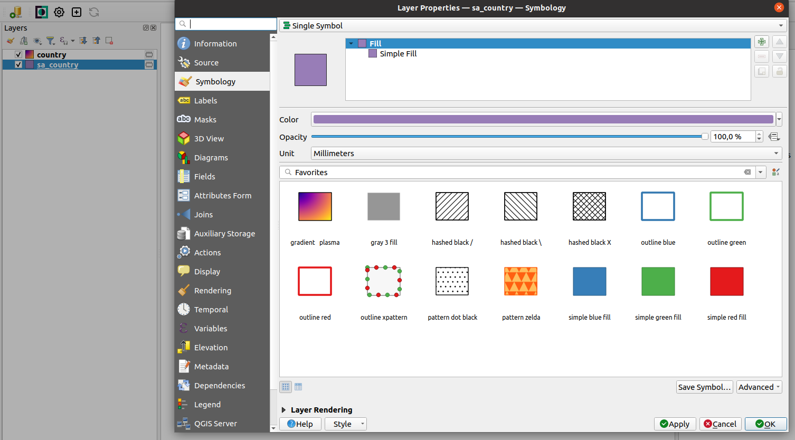
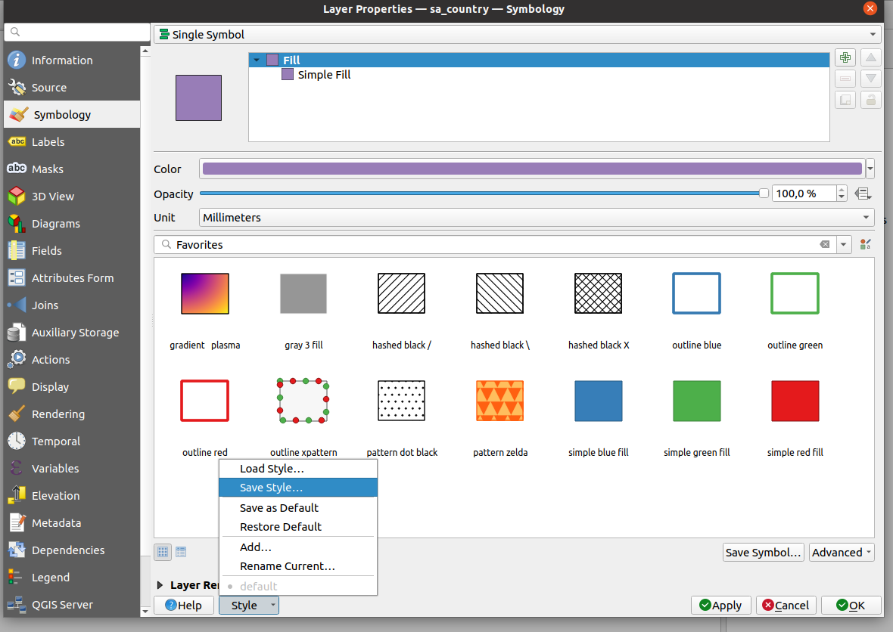
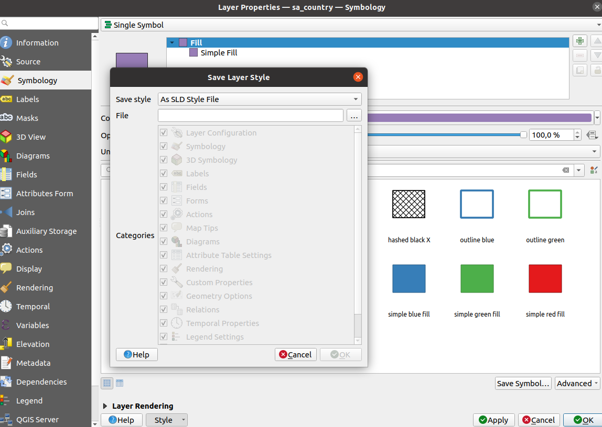
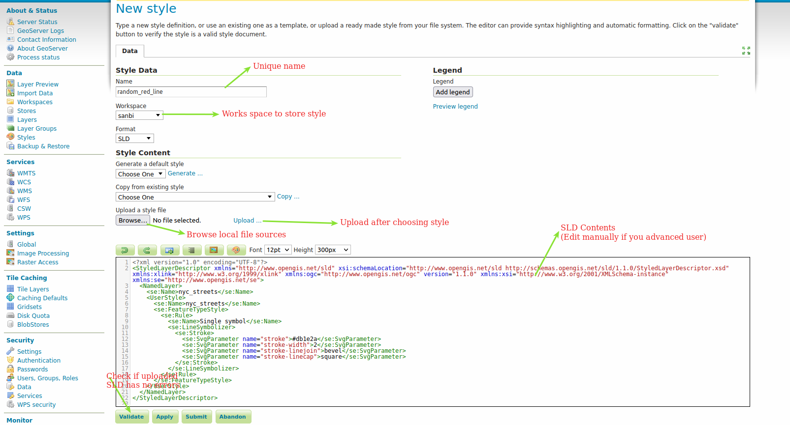
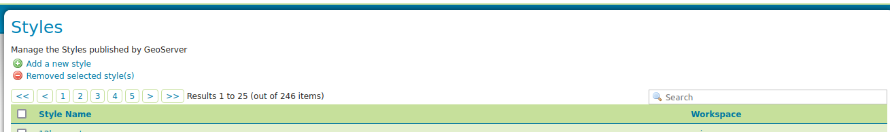
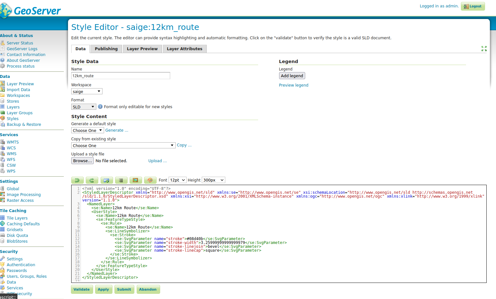
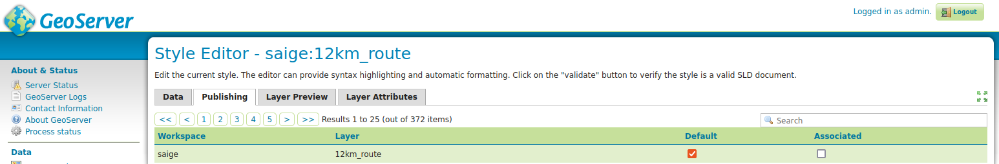

GeoServer provides a couple of ways to symbolize vector and raster data. The most
common way is by using SLD (Styled Layer Descriptor) which is an OGC standard.
GeoServer also adds some flavour to the format which enriches how to symbolize vector/raster
data. Other less common ways to symbolize data include using CSS(Cascading style sheets) and YSLD.

There are various open source software which allows you to export SLD natively. Since we are
familiar with QGIS we will use it as our defacto Desktop GIS system.

> Although QGIS can export SLD it does not produce a 1-1 mapping of the rich
cartography that is available in QGIS. It is recommended to use simple styles when your goal
is to use the SLD exporter from QGIS.

## Styling Vector layers in QGIS

**Step 1.** Load your vector layers in QGIS.

**Step 2.** Right-click on the vector layer and choose the symbology tab.

**Step 3.** Select an appropriate style from the options. Be thoughtful of all the
cartographic rules and the limitations of the exporter when choosing a style.

**Step 4.** If you are satisfied with your result click **Apply**.

**Step 5.**Click on the **Style** link to show the hidden context menu.

**Step 6.** Save your style as SLD.

**Step 7.** Export the SLD to disk and wait to upload to GeoServer.

## Publishing style in GeoServer

**Step 1.** Navigate to GeoServer and click on the style tab.

**Step 2.** Click to **Add New Style**.

**Step 3.** Browse and upload your style into GeoServer.

**Step 4.** Submit your results and this will take you back to your style.

**Step 5.** Use the search box at the top of the style to identify the name of the style you created above.

**Step 6.** Open the style again and indicated below.

**Step 7.** Select the layer you want to associate your style with.

There are two options:

* **Default style** - Visible when you preview the map.
* **Associated style** - Visible when you change the URL for a GetMap / Getlegend request

**Step 8.** Submit your results.

> This process applies to also styling raster data.
