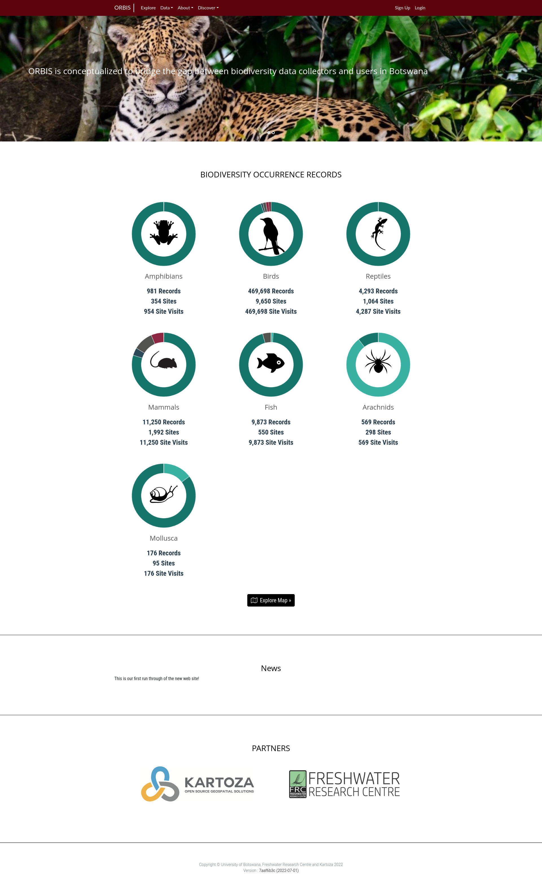
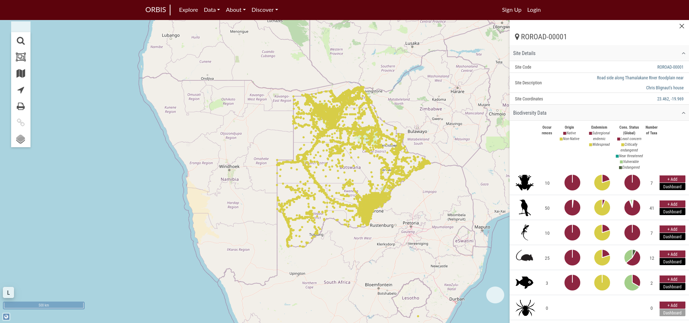

# ORBIS

Web Site: [https://orbis.kartoza.com](https://orbis.kartoza.com)

Okavango Repository for BIodiverSity Data (ORBIS)

The **O**kavango **R**epository for **BI**odiver**S**ity Data (ORBIS) is conceptualised to bridge the gap between biodiversity data collectors and users in Botswana, with an emphasis on policymakers responsible for conservation management decisions.

Through continued engagement with stakeholders via the ORBIS reference group and capacity-building activities, ORBIS will improve the pathways from biodiversity data to policies, ensuring that stakeholders are empowered to make evidence-based decisions relating to biodiversity management.

For more information, contact us at: ebennitt@ub.ac.bw
