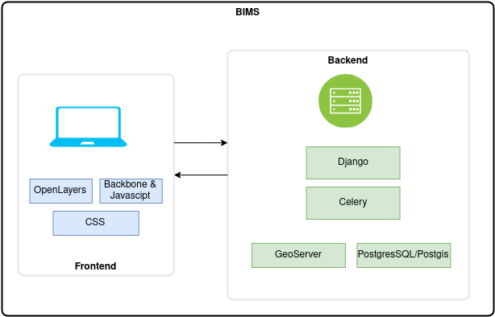

### BIMS Architecture

### GeoServer

[GeoServer](http://geoserver.org) is an open-source server written in Java that allows users to share, process and edit geospatial data.
GeoServer implements industry-standard OGC protocols such as Web Feature Service (WFS), Web Map Service
(WMS), and Web Coverage Service (WCS). Additional formats and publication options are available as extensions,
including Web Processing Service (WPS) and Web Map Tile Services (WMTS).

### Django

BIMS is based on [Django](www.djangoproject.com), which is a high-level python web framework. Django follows the
model-template-views architecture pattern.

### Celery

BIMS uses [Celery](https://docs.celeryq.dev/en/stable/getting-started/introduction.html) for handling background tasks.

### PostgresSQL/PostGIS

PostgreSQL and the PostGIS make up the database that stores and manages both the spatial data and information for BIMS.

### OpenLayers

[OpenLayers](https://openlayers.org/) is used for map interactions and geospatial operations in BIMS.

### Backbone.js & Javascript

Backbone.js is a JavaScript rich-client web app framework based on the model–view–controller design paradigm. BIMS
uses it to provide specific front-end functionality.

### CSS

CSS is a style sheet language used for describing the presentation of the page HTML in BIMS.
