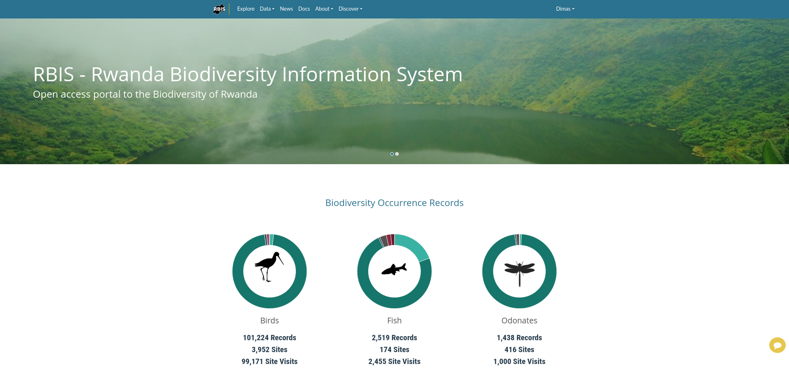
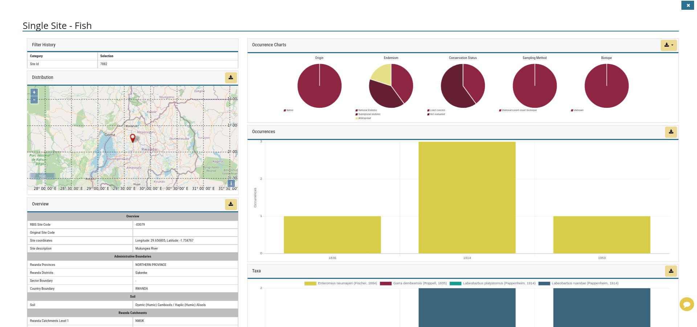

# RBIS

Web Site: [https://rbis.ur.ac.rw/](https://rbis.ur.ac.rw/)

We are CoEB - the Center of Excellence in Biodiversity and Natural Resource Management, Rwanda

CoEB is a Rwandan Government institution that functions as a consortium of governmental and non-governmental organizations, bringing together expertise and skills to produce information needed for effective policy and science-driven economic transformation.  The Center is hosted at University of Rwanda and works in three areas: research and monitoring, bioprospecting, and conservation education and awareness raising.

The Center plays a catalytic and coordinating role to ensure sharing of scientific knowledge and expertise for evidence-based decisions in conservation, natural resource management and climate resiliency.  We provide leadership, best practices, research, support and training in the domain of biodiversity, natural resource management, and impacts of climate change on ecosystems and livelihoods.  The goal is to encourage, enable and support stakeholders to generate and apply knowledge on biodiversity and natural resources for sustainable development. We address the need for data for national reporting requirements (CBD, NDC, etc.) and to inform existing indicators of global biodiversity trends, such as the Living Planet Index from WWF, the Red List Index, GEO BON Species Protection Index, and the need for data in land use planning decisions, restoration projects, and ecosystem health and services provisioning.

A biodiversity information system takes biodiversity observation records that are stored in a variety of sources and formats and puts them into a standardized format on a viewing platform to enable stakeholders to access and use the information. Biodiversity data for Rwanda have been scattered and difficult to access, but are critical to understanding patterns of biodiversity distribution, ecosystem functioning, and early detection of environmental change. Species records can provide indication of climate change impacts, pollution effects, and guide development, land use planning, tourism opportunities, and monitoring of restoration efforts. An information system puts data at your fingertips for national reporting requirement needs like the CBD and NDC.   The system effectively links research to conservation and policy.

With funding from the JRS Biodiversity Foundation <https://jrsbiodiversity.org/> we are developing the first national biodiversity information system for Rwanda.  We call it the Rwanda Biodiversity Information System or RBIS. Thanks to generous collaboration from data holders who graciously shared their data sets, including independent researchers, NGOs and government institutions, we have already mobilized more than 30,000 biodiversity data records.

We begin the RBIS with a focus on biodiversity data in freshwater ecosystems. We have mobilized data on odonates, anurans, and birds, thanks to the generous data sharing by data holders.  Our aim is to demonstrate the power of the RBIS to inform wetlands and catchment management using biodiversity data to indicate ecosystem health.  We will eventually scale the RBIS up to include all ecosystems in Rwanda.

When you enter the Explore button, you will see the base map of Rwanda and you can begin to explore and query the system for information.  We hope you find this resource valuable and we welcome your feedback.

For more information, contact us at: coeb1@ur.ac.rw
